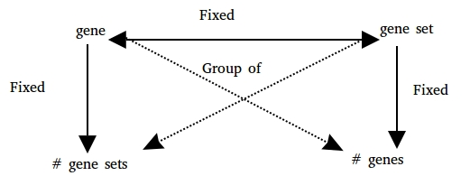

[](https://travis-ci.org/llrs/GSEAdv)
[](https://ci.appveyor.com/project/llrs/GSEAdv)
[](https://codecov.io/github/llrs/GSEAdv?branch=master)
[](https://www.tidyverse.org/lifecycle/#experimental)
[](http://www.repostatus.org/#concept)

# GSEAdv

The goal of GSEAdv is to provide tools for better methods with gene sets collections. 

GSEAdv is based on the relationship between genes and gene sets under this schema:


And provides methods to understand the relationships between each property of 
the schema and as a whole. 

# How does it work?

It is an R package you can install it from the Bioconductor project with:

```r
## try http:// if https:// URLs are not supported
## source("https://bioconductor.org/biocLite.R")
## biocLite("GSEAdv")
```
You can install this version of *GSEAdv* with:
```r
library("devtools")
install_github("llrs/GSEAd")
```

# Who will use this repo or project?

It is intended for bioinformaticians, both people interested in *comparing* groups of gene sets or databases and people *developing* analysis using the information provided by *GSEAdv*.

# How to use GSEAdv?

See the vignette.

# What is the goal of this project?

The goal of this project is to be able to understand the gene sets collections available.

# What can be *GSEAdv* used for?

 - Compare pathway database:  
  By comparing the differences between them.
 - Select the gene set collection of interest:
  By testing their properties. 
 
# Contributing

Please read [how to contribute](.github/CONTRIBUTING.md) for details on the code of conduct, and the process for submitting pull requests.

# Acknowledgments

The ideas of this package were developed after a colleague asked a question in a poster presentation of my other package [BioCor](https://github.com/llrs/BioCor). 

