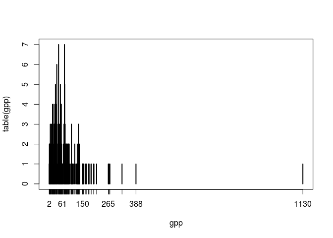
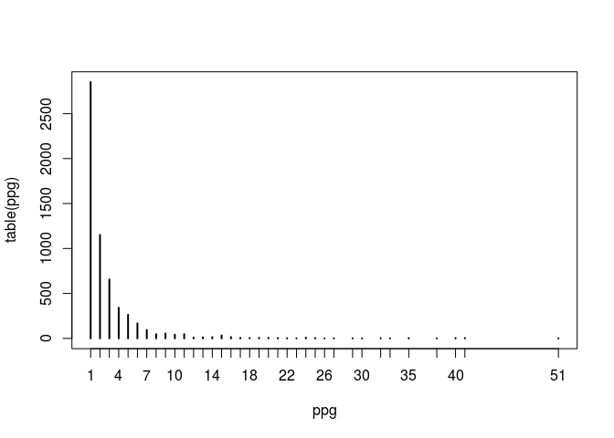

<!-- README.md is generated from README.Rmd. Please edit that file -->
GSEAdv
======

[](https://travis-ci.org/llrs/GSEAdv) [](https://ci.appveyor.com/project/llrs/GSEAdv) [](https://codecov.io/github/llrs/GSEAdv?branch=master) [](https://www.tidyverse.org/lifecycle/#experimental) [](http://www.repostatus.org/#concept)

The goal of GSEAdv is to provide tools for better methods with gene sets collections.

GSEAdv is based on the relationship between genes and gene sets under this schema: 

And provides methods to understand the relationships between each property of the schema and as a whole.

Installation
------------

It is an R package you will be able to install it from the Bioconductor project with:

``` r
## install.packages("BiocManager") 
BiocManager::install("GSEAdv")
```

You can install this version of *GSEAdv* with:

``` r
## install.packages("devtools")
devtools::install_github("llrs/GSEAdv")
```

How does it work?
=================

It is simple, load the package and learn from your data!

``` r
# Load some data
library("GSEAdv")
fl <- system.file("extdata", "Broad.xml", package = "GSEABase")
gss <- getBroadSets(fl)
gss
## GeneSetCollection
##   names: chr5q23, chr16q24 (2 total)
##   unique identifiers: ZNF474, CCDC100, ..., TRAPPC2L (215 total)
##   types in collection:
##     geneIdType: SymbolIdentifier (1 total)
##     collectionType: BroadCollection (1 total)
summary(gss)
## Genes: 215
##  Gene in more pathways: 1 pathways
##  h-index: 0 genes with at least 0 pathways.
## Pathways: 2
##  Biggest pathway: 129 genes
##  h-index: 1 pathways with at least 1 genes.
## All genes in a single gene set.
```

Which tells us that each gene in the GeneSetCollection is only on one gene set.

We can try with a bigger dataset, one derived from human genes pathways in KEGG:

``` r
summary(genesKegg)
## Genes: 5869
##  Gene in more pathways: 51 pathways
##  h-index: 0 genes with at least 0 pathways.
## Pathways: 228
##  Biggest pathway: 1130 genes
##  h-index: 15 pathways with at least 15 genes.
## IC(genesPerPathway): 6.65 ( 0.96 of the maximum)
## IC(pathwaysPerGene): 2.47 ( 0.48 of the maximum)
```

Knowing that it has so much pathways and genes we can learn how do they relate. The number of genes per pathway in the collection is:

``` r
gpp <- genesPerPathway(genesKegg)
plot(table(gpp))
```

 We can see that most gene sets have low number of genes but one has 1130 genes in a single gene set (It is the gene set `names(gpp)[gpp > 400]`). The genes might be associated too with many gene sets, it is so extreme? Let's see:

``` r
ppg <- pathwaysPerGene(genesKegg)
plot(table(ppg))
```

 Not so extreme, one gene (`names(ppg)[which.max(ppg)]`) appears in `max(ppg)` gene sets.

To see which gene sets are included in other gene sets we can use `nested`:

``` r
nested(genesKegg)[1:10, 80:90]
##       00970 00980 00982 00983 01040 01100 02010 03008 03010 03013 03015
## 00010     0     0     0     0     0     0     0     0     0     0     0
## 00020     0     0     0     0     0     1     0     0     0     0     0
## 00030     0     0     0     0     0     0     0     0     0     0     0
## 00040     0     0     0     0     0     0     0     0     0     0     0
## 00051     0     0     0     0     0     0     0     0     0     0     0
## 00052     0     0     0     0     0     0     0     0     0     0     0
## 00053     0     0     0     0     0     0     0     0     0     0     0
## 00061     0     0     0     0     0     1     0     0     0     0     0
## 00062     0     0     0     0     0     1     0     0     0     0     0
## 00071     0     0     0     0     0     0     0     0     0     0     0
```

As expected the pathway with more than 1100 genes has other pathways inside it.

You can see the vignettes for more examples.

Who will use this repo or project?
==================================

It is intended for bioinformaticians, both people interested in *comparing* databases and people *developing* analysis using the information provided by *GSEAdv*.

What is the goal of this project?
=================================

The goal of this project is to be able to understand the gene sets collections available.

What can be *GSEAdv* used for?
==============================

-   Compare pathway database:
    By comparing the differences between them.
-   Select the gene set collection of interest: By testing their properties.

Contributing
============

Please read [how to contribute](.github/CONTRIBUTING.md) for details on the code of conduct, and the process for submitting pull requests.

You can also look at the [tests](https://github.com/llrs/GSEAdv/tree/master/tests) and increase the quality of the package.

Acknowledgments
===============

The ideas of this package were developed after a colleague asked a question in a poster presentation of my other package [BioCor](https://github.com/llrs/BioCor).
