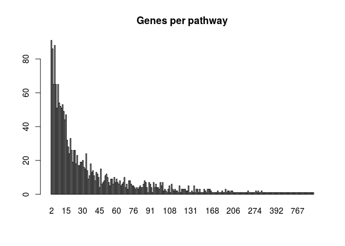
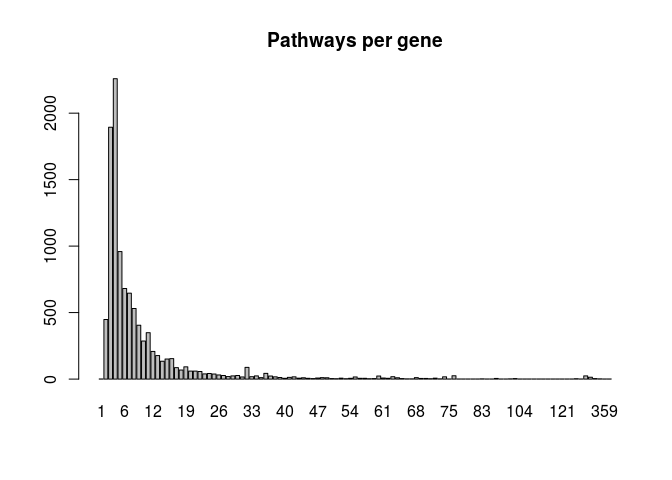
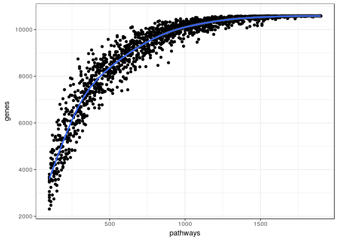
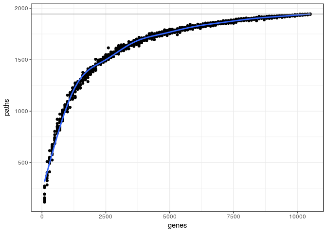

<!-- README.md is generated from README.Rmd. Please edit that file -->
GSEAdv
======

[](https://travis-ci.org/llrs/GSEAdv) [](https://ci.appveyor.com/project/llrs/GSEAdv) [](https://codecov.io/github/llrs/GSEAdv?branch=master) [](https://www.tidyverse.org/lifecycle/#experimental) [](http://www.repostatus.org/#concept)

The goal of GSEAdv is to provide tools for better methods with gene sets collections.

GSEAdv is based on the relationship between genes and gene sets under this schema: 

And provides methods to understand the relationships between each property of the schema and as a whole.

Installation
------------

It is an R package you can install it from the Bioconductor project with:

``` r
## try http:// if https:// URLs are not supported
## source("https://bioconductor.org/biocLite.R")
## biocLite("GSEAdv")
```

You can install this version of *GSEAdv* with:

``` r
## library("devtools")
devtools::install_github("llrs/GSEAdv")
```

How does it work?
=================

It is simple, load the package and learn about your data!

``` r
# Load some data
library("GSEAdv")
fl <- system.file("extdata", "Broad.xml", package = "GSEABase")
gss <- getBroadSets(fl)
gss
## GeneSetCollection
##   names: chr5q23, chr16q24 (2 total)
##   unique identifiers: ZNF474, CCDC100, ..., TRAPPC2L (215 total)
##   types in collection:
##     geneIdType: SymbolIdentifier (1 total)
##     collectionType: BroadCollection (1 total)
summary(gss)
## Genes: 215
##  Gene in more pathways:1pathways
##  h-index:0genes with at least0pathways.
## Pathways:2
##  Biggest pathway:129genes
##  h-index:1pathways with at least1genes.
##  All genes in a single gene set.
## Some gene set have all genes not present in other gene sets
```

Which tells us that each gene in the GeneSetCollection is only on one gene set.

If we want to explore the human pathways of [REACTOME](https://reactome.org/)

``` r
library("reactome.db")
genesReact <- as.list(reactomeEXTID2PATHID)
# Remove genes and pathways which are not from human pathways 
human <- sapply(genesReact, function(x){all(grepl(pattern = "R-HSA-", x))})
genesReact <- genesReact[human]
genesReact <- as.GeneSetCollection(genesReact)
## Warning in check_size(object): Removing 203 genes sets with only one gene.
barplot(table(genesPerPathway(genesReact)), main = "Genes per pathway")
```



and the number of pathways

``` r
barplot(table(pathwaysPerGene(genesReact)), main = "Pathways per gene")
```

 And the relationship between them:

``` r
nPaths <- nPathways(genesReact)
seqs <- seq(from = 100, to = signif(nPaths, 2), by = 10)

o <- sapply(rep(seqs, each = 10), function(x){
  c("pathways" = x, 
    # Randomly select some x pathways
    # check the properties
    # calculate the number of genes of these GeneSetCollection
    "genes" = nGenes(check(genesReact[sample(seq_len(nPaths), x)])))
})
out <- as.data.frame(t(o))
library("ggplot2")
ggplot(out, aes(pathways, genes)) + 
  geom_point() + 
  geom_smooth() + 
  theme_bw() +
  geom_hline(yintercept = nGenes(genesReact), col = "darkgrey")
```



We can do the same for the number of genes

``` r
nGenes <- nGenes(genesReact)
seqs <- seq(from = 100, to = signif(nGenes, 3)-100, by = 100)
paths2genes <- geneIds(genesReact)
genes2paths <- GSEAdv:::inverseList(paths2genes)
o <- sapply(rep(seqs, each = 10), function(x){
  paths2genes <- GSEAdv:::inverseList(genes2paths[sample(seq_along(genes2paths), x)])
  
  c("genes" = x, 
    # Randomly select some x genes
    # check the properties
    # calculate the number of pathways of these GeneSetCollection
    "paths" = sum(lengths(paths2genes) >= 2)) 
})
out <- as.data.frame(t(o))
ggplot(out, aes(genes, paths)) + 
  geom_point() + 
  geom_smooth() + 
  theme_bw()  +
  geom_hline(yintercept = nPathways(genesReact), col = "darkgrey")
```



Who will use this repo or project?
==================================

It is intended for bioinformaticians, both people interested in *comparing* databases and people *developing* analysis using the information provided by *GSEAdv*.

What is the goal of this project?
=================================

The goal of this project is to be able to understand the gene sets collections available.

What can be *GSEAdv* used for?
==============================

-   Compare pathway database:
    By comparing the differences between them.
-   Select the gene set collection of interest: By testing their properties.

Contributing
============

Please read [how to contribute](.github/CONTRIBUTING.md) for details on the code of conduct, and the process for submitting pull requests.

Acknowledgments
===============

The ideas of this package were developed after a colleague asked a question in a poster presentation of my other package [BioCor](https://github.com/llrs/BioCor).
